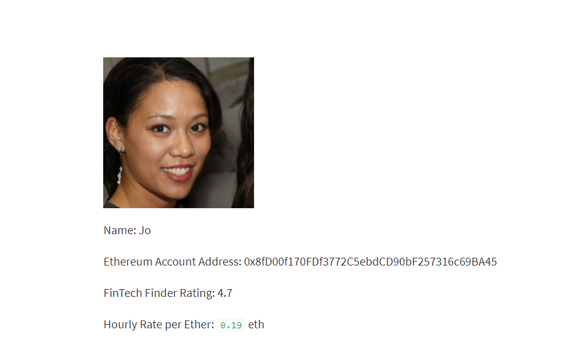
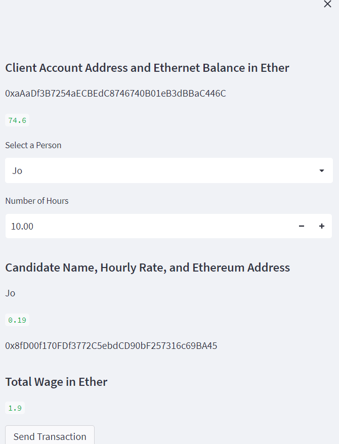
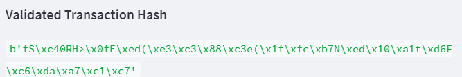
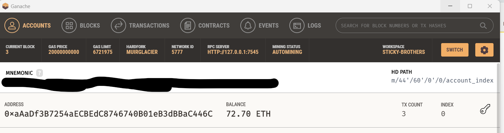
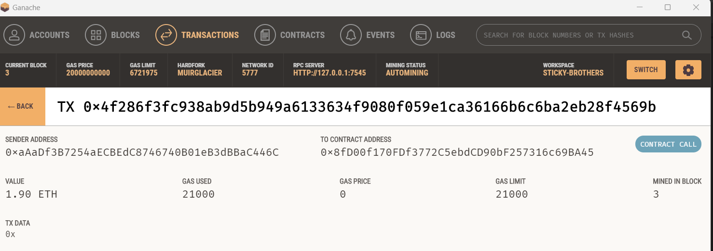

# Fintech_Finder
UW Fintech Bootcamp Module 19 Challenge

---

## Technologies

The following libraries are used in this analysis:  
  
  * streamlit  
  * ganache
  * dataclasses
  * typing
  * web3
  
---

## Purpose of Project

The main purpose of this project is to demonstrate an ability build a cryptocurrency wallet as well as a program to find, contract, and pay fintech professionals for projects.  Ganache was used to establish test ethereum accounts to demontrate capabilities    
  
---

## Examples

Through the use of streamlit I was able to build a program that would allow me to review fintech professionals: 
 
 
 
 
I was able to calculate the required ether for my project:
  
  
  
I executed the transaction as shown on my account page (note there were multiple tranactions out of my account due to practice), and can display that it executed:
  
    
    
    
    
  
  

Overall I can certainly see the value of of such technology and the ability to work with it enhancing my career opportunities as a fintech professional.  

---

## Contributors

The majority of this project has been done independently.

---

## License

Program is free to use without license.  Only request is that you notify author of use and application.
  
To discuss usage or general inquires please contact the author at jonm5214@gmail.com